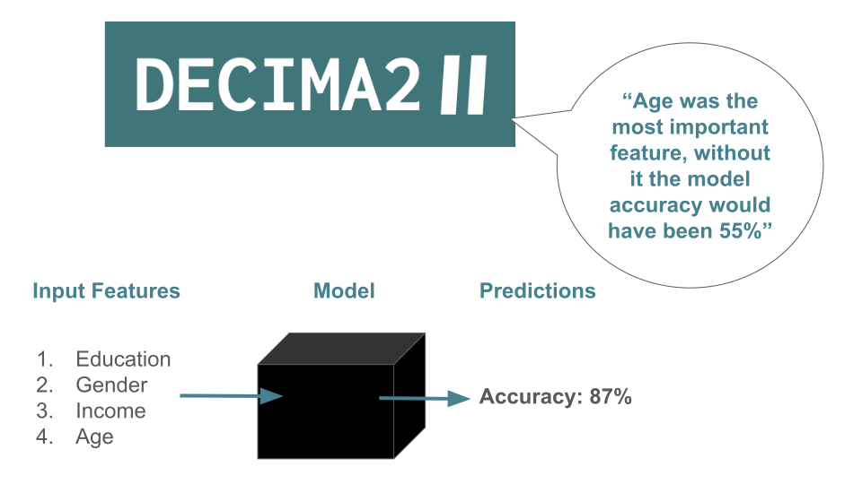
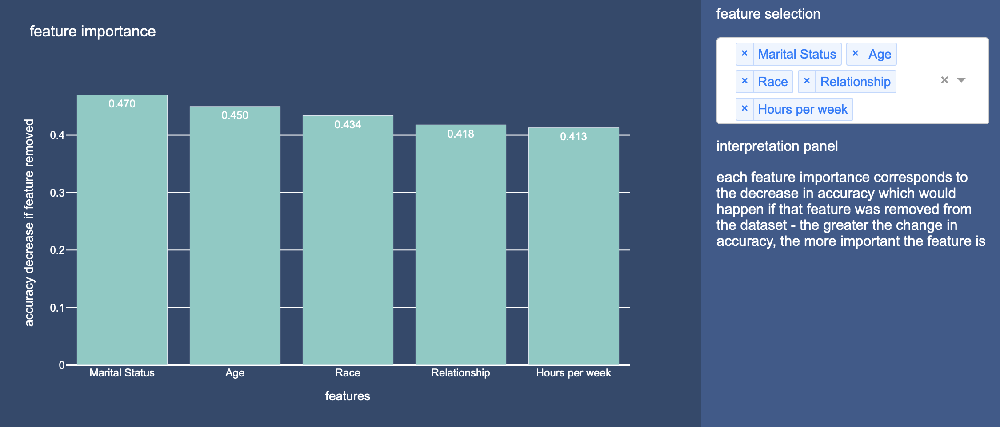

# Decima2 AI Evaluation Toolkit

  

## Introduction
Welcome to the Decima2 AI Evaluation Toolkit — a comprehensive suite of tools designed to empower developers with the insights needed to effectively evaluate and enhance machine learning models. Our toolkit focuses on making complex concepts in machine learning intuitive and accessible, allowing users to derive meaningful insights without the steep learning curve often associated with advanced analytics.

## Table of Contents
1. [Installation](#installation)
2. [Model Tools](#model-tools)
  2.1 [Model Feature Importance](#model-feature-importance)
3. [Data Tools](#data-tools)
4. [Outcome Tools](#outcome-tools)
5. [License](#license)
6. [Contributing](#contributing)
7. [Contact](#contact)

## Installation

You can install the package using pip:

<pre>
pip install decima2
</pre>

## Model Tools

Gain insights into how your models make predictions with clear, interpretable visualizations and explanations, making it easier to communicate results. 

### Model Feature Importance (Tabular)

  

#### Usage
Here’s a quick example of how to use model_feature_importance to evaluate a machine learning model and compute feature importances. We recommend using this explanation method on tabular (numerical) data with less than 100 fetures. 

#### Example
##### Load Data and Train Your Model 
<pre>
import pandas as pd
import numpy as np
from sklearn.ensemble import RandomForestClassifier

from decima2 import model_feature_importance

# Load your dataset
df = pd.read_csv('your_dataset.csv')
y = df['target']
X = df.drop(columns=['target'])

X_train, X_test, y_train, y_test = train_test_split(X y, test_size=0.20, random_state=42)
model = RandomForestClassifier(max_depth=100, random_state=42)
model.fit(X_train, y_train)

</pre>

#### Call Model Feature Importance:
-----------
<pre>
model_feature_importance(X, y, model, output='dynamic'):
    Generates explanations for the provided model, which can be returned as text, static image, or interactive app.
    Parameters:
    -----------
    - X: pandas DataFrame
        The feature matrix (input data) which was used to test the model. Each column should be of numeric type. 
    - y: pandas Series or Numpy array
        The target variable corresponding to X.
    - model: scikit-learn, Keras, Pytorch compatible model
        The machine learning model for which the feature importance and explanations are generated.
    - output: str, default='dynamic'
        The output type for explanations. Options include:
        - 'text': Returns a textual summary of feature importances.
        - 'static': Generates a static image visualizing feature importances.
        - 'dynamic': Returns an interactive dashboard (using Dash) for visualizing feature importances.

    Returns:
    --------
    - Depending on the `output` argument, the function returns either:
      - A textual summary of feature names with their importances,
      - A static Plotly figure visualizing feature importances, or
      - An interactive Dash app for exploring feature importances dynamically.
</pre>

##### Generate Explanations and View Via Interactive App

<pre>
explanation_app = model_feature_importance(X_test,y_test,model,output='dynamic')
explanation_app.run_server()
</pre>

##### Generate Explanations and View Via Static Graph

<pre>
explanation_plot = model_feature_importance(X_test,y_test,model,output='static')
</pre>

##### Generate Explanations and View Via Text

<pre>
explanations = model_feature_importance(X_test,y_test,model,output='text')
print(explanations)
</pre>

## Data Tools
### Coming Soon
These tools help you evaluate your data 

## Outcome Tools
### Coming Soon 
These tools help you to evaluate the outcomes of your model

## License
This project is licensed under the MIT License. See the LICENSE file for details.

## Contributing
Contributions are welcome! Please create a pull request or open an issue for any improvements, bugs, or feature requests.

## Contact
For inquiries, please reach out to tortysivill@decima2.co.uk