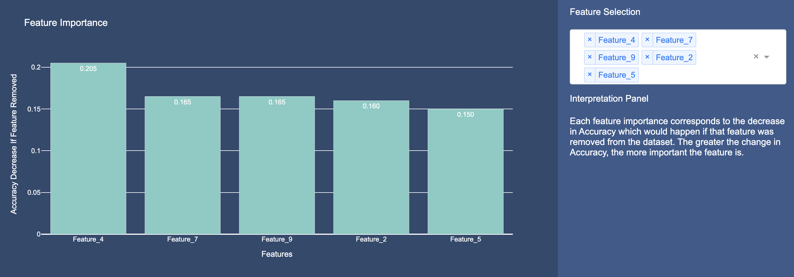

# Decima2 AI Evaluation Toolkit

  

## Introduction
Welcome to the Decima2 AI Evaluation Toolkit — a comprehensive suite of tools designed to empower developers with the insights needed to effectively evaluate and enhance machine learning models. Our toolkit focuses on making complex concepts in machine learning intuitive and accessible, allowing users to derive meaningful insights without the steep learning curve often associated with advanced analytics.

## Table of Contents
1. [Installation](#installation)
2. [Model Tools](#model-tools)
   - [Model Feature Importance](#model-feature-importance)
   - [Grouped Feature Importance](#grouped-feature-importance)
3. [Data Tools](#data-tools)
4. [Outcome Tools](#outcome-tools)
   - [Individual NLP Explanation](#individual-nlp-explanation)
   - [Individual Feature Importance](#individual-feature-importance)
5. [License](#license)
6. [Contributing](#contributing)
7. [Contact](#contact)

## Installation

You can install the package using pip:

<pre>
pip install decima2
</pre>

## Model Tools

Gain insights into how your models make predictions with clear, interpretable visualizations and explanations, making it easier to communicate results. 

### Model Feature Importance
For Tabular Data 

  

<pre>
from decima2 import model_feature_importance
</pre>

This tool allows users to examine which features were most important for their model's perfomance. Given a numerical dataset and pre-trained model, the model_feature_importance module returns either a textual or graphical representation of which features were most important. 

#### Instructions
For detailed usage instructions and to explore how the module works check out our [Developer Docs](https://docs.decima2.co.uk/docs/explanation/model-feature-importance) 
#### Tutorial 
To explore tutorials on model feature importance including motivations and comparisons with SHAP check out our [Jupyter Notebooks](https://github.com/Decima2/Decima2Toolkit/tree/main/examples/model_insights/model_explanations)  

#### Usage
Here’s a quick example of how to use model_feature_importance to evaluate a machine learning model and compute feature importances. We recommend using this explanation method on tabular (numerical) data with less than 100 features. 

#### Example
##### Load Data and Train Your Model 
<pre>
import pandas as pd
import numpy as np
from sklearn.ensemble import RandomForestClassifier

from decima2 import model_feature_importance

# Load your dataset
df = pd.read_csv('your_dataset.csv')
y = df['target']
X = df.drop(columns=['target'])

X_train, X_test, y_train, y_test = train_test_split(X y, test_size=0.20, random_state=42)
model = RandomForestClassifier(max_depth=100, random_state=42)
model.fit(X_train, y_train)

</pre>

#### Call Model Feature Importance:
-----------
<pre>
model_feature_importance(X, y, model, output='dynamic'):
    Generates explanations for the provided model, which can be returned as text, static image, or interactive app.
    Parameters:
    -----------
    - X: pandas DataFrame
        The feature matrix (input data) which was used to test the model. Each column should be of numeric type. 
    - y: pandas Series or Numpy array
        The target variable corresponding to X.
    - model: scikit-learn, Keras, Pytorch compatible model
        The machine learning model for which the feature importance and explanations are generated.
    - output: str, default='dynamic'
        The output type for explanations. Options include:
        - 'text': Returns a textual summary of feature importances.
        - 'static': Generates a static image visualizing feature importances.
        - 'dynamic': Returns an interactive dashboard (using Dash) for visualizing feature importances.

    Returns:
    --------
    - Depending on the `output` argument, the function returns either:
      - A textual summary of feature names with their importances,
      - A static Plotly figure visualizing feature importances, or
      - An interactive Dash app for exploring feature importances dynamically.
</pre>

##### Generate Explanations and View Via Interactive App

<pre>
explanation_app = model_feature_importance(X_test,y_test,model,output='dynamic')
explanation_app.run_server()
</pre>

##### Generate Explanations and View Via Static Graph

<pre>
explanation_plot = model_feature_importance(X_test,y_test,model,output='static')
</pre>

##### Generate Explanations and View Via Text

<pre>
explanations = model_feature_importance(X_test,y_test,model,output='text')
print(explanations)
</pre>

### Grouped Feature Importance
For Tabular Data 

  

<pre>
from decima2 import grouped_feature_importance
</pre>

This tool builds on model_feature_immportance to give users an insight into which features were most influential for their model over a **select group of data**. For example, a user may want to compare the most important feature across men and women in their data, or people with an income over 65k and under 65k. 

#### Instructions
For detailed usage instructions and to explore how the module works check out our [Developer Docs](https://docs.decima2.co.uk/docs/explanation/grouped-feature-importance) 
#### Tutorial 
To explore tutorials on grouped feature importance including motivation and use-cases check out our [Jupyter Notebooks](https://github.com/Decima2/Decima2Toolkit/tree/main/examples/model_insights/model_explanations)  

#### Usage
Here’s a quick example of how to use grouped_feature_importance to evaluate a machine learning model and compute feature importances. We recommend using this explanation method on tabular (numerical) data with less than 100 features. We reccomend grouping your selected feature into an interpretable number of categories ('auto' is 5 if not categorical).

#### Example
##### Load Data and Train Your Model 
<pre>
import pandas as pd
import numpy as np
from sklearn.ensemble import RandomForestClassifier

from decima2 import grouped_feature_importance

# Load your dataset
df = pd.read_csv('your_dataset.csv')
y = df['target']
X = df.drop(columns=['target'])

X_train, X_test, y_train, y_test = train_test_split(X y, test_size=0.20, random_state=42)
model = RandomForestClassifier(max_depth=100, random_state=42)
model.fit(X_train, y_train)

</pre>

#### Call Grouped Feature Importance:
-----------
<pre>
grouped_feature_importance(X, y, model, feature_name, output='dynamic', number_of_categories='auto'):
    Generates explanations for the provided model over different groups of the selected feature, which can be returned as text or interactive app.
    
    Args:
    -----
    - X (pandas.DataFrame): The feature matrix (input data) used for model evaluation.
    - y (pandas.Series or numpy.ndarray): The target variable corresponding to X.
    - model (scikit-learn, Keras, Pytorch compatible model): The machine learning model for which feature importances 
      will be calculated.
    - feature_name (str): The name of the feature used to group the data into different categories or ranges for 
      analysis. Must be one of the columns of X
    - output (str, default='dynamic'): Specifies the output type. Options include:
        - 'text': Returns a textual summary of the grouped feature importances.
        - 'dynamic': Returns an interactive Dash app to visualize and explore feature importances for the different 
          feature groupings.
    - number_of_categories (str or int, default='auto'): If not 'auto', input must be an int. Defines the number of categories or ranges into which `feature_name` should be discretized. If set to 'auto', the function will automatically determine the number of categories based on the uniqueness of the feature values. Must be less than log2(size of X)

    Returns:
    --------
    - If `output == 'text'`: Returns a dictionary of grouped feature importances where the keys are the categories 
      (or ranges) of the `feature_name`, and the values are dictionaries of feature importances for each group.
    - If `output == 'dynamic'`: Returns an interactive Dash app to visualize the feature importances grouped by 
      `feature_name` and allows users to explore the feature importance dynamically.
</pre>

##### Generate Explanations and View Via Interactive App

<pre>
explanation_app = grouped_feature_importance(X_test,y_test,model,'feature_0',output='dynamic')
explanation_app.run_server()
</pre>

##### Generate Explanations and View Via Text

<pre>
explanation_app = grouped_feature_importance(X_test,y_test,model,'feature_0',output='text')
print(explanations)
</pre>

## Data Tools
### Coming Soon
These tools help you evaluate your data 

## Outcome Tools
These tools help you to evaluate the outcomes of your model

### Individual NLP Explanation
Understand which terms were most impactful in driving the similarity between two embedded texts

  

<pre>
from decima2 import individual_nlp_explanation
</pre>

This tool allows users to explore which terms were most influential in driving similarity score between the two texts in embedded space as determined by the user specified model.  

#### Instructions
For detailed usage instructions and to explore how the module works check out our [Developer Docs](https://docs.decima2.co.uk/docs/) 
#### Tutorial 
To explore tutorials on individual nlp explanation and use-cases check out our [Jupyter Notebooks](https://github.com/Decima2/Decima2Toolkit/tree/main/examples/outcome_insights/individual_nlp_explanation)  

#### Usage
Here’s a quick example of how to use individual nlp explanations to evaluate word and concept importance in embedding space. This functionality can be applied to any Hugging Face model. 

#### Example
##### Load Data and Model 
<pre>
import pandas as pd
import numpy as np

from decima2 import individual_nlp_explanation

# Load your text
text1 = "the cat sat on the mat and it purred"
text2= "the dog lay upon the mat and it barked"
model_name = "bert-base-uncased"

</pre>

#### Call Individual NLP Explanation:
-----------
<pre>
def individual_nlp_explanation(text1, text2, model_name, output='dynamic') :
  Analyzes the similarities and differences between two input texts by extracting key bigrams, generating 
  embeddings, and comparing them to identify impactful pairs. Returns pairs that increase and decrease similarity 
  between the two texts, or generates a dynamic visualization app.

  Parameters
  ----------
  text1 : str
      The first text input to analyze.
  text2 : str
      The second text input to analyze.
  model_name : str
      The name of the embedding model to use for encoding text bigrams.
  output : str, optional, default='dynamic'
      Specifies the output type:
      - 'text': returns lists of impactful bigram pairs with similarity effects.
      - 'dynamic': returns an interactive app for visualizing similarity effects.

  Returns
  -------
  tuple or app
      If `output` is 'text', returns a tuple of two lists:
      - similarity_increasers : list of tuples
          Pairs of bigrams that increase the similarity between `text1` and `text2`.
      - similarity_decreasers : list of tuples
          Pairs of bigrams that decrease the similarity between `text1` and `text2`.
      
      If `output` is 'dynamic', returns a Flask app for interactive visualization of 
      similarity increasers and decreasers.
</pre>

##### Generate Explanation and View Via Interactive App

<pre>
app = individual_nlp_explanation(text1, text2, model_name, output='dynamic')
app.run()  # This will start a web server for visualizing similarity comparisons.
</pre>

##### Generate Explanation and View Via Text

<pre>
similarity_increasers, similarity_decreasers = individual_nlp_explanation(text1, text2, model_name, output="text")
print("Pairs that increase similarity:", similarity_increasers)
print("Pairs that decrease similarity:", similarity_decreasers)

</pre>

### Individual Feature Importance
For Tabular Data 

  

<pre>
from decima2 import individual_feature_importance
</pre>

This tool allows users to examine which features were most important for an individual prediction. Given a numerical dataset, a pre-trained model and an instance to be explainaed, the individual_feature_importance module returns a graphical representation of which features were most important. 
   
#### Tutorial 
To explore tutorials on individual feature importance and use-cases check out our [Jupyter Notebooks](https://github.com/Decima2/Decima2Toolkit/tree/main/examples/outcome_insights/)  

#### Usage
Here’s a quick example of how to use individual_feature_importance to evaluate a machine learning model and compute feature importances. We recommend using this explanation method on tabular (numerical) data with less than 100 features. 

#### Example
##### Load Data and Train Your Model 
<pre>
import pandas as pd
import numpy as np
from sklearn.ensemble import RandomForestClassifier

from decima2 import individual_feature_importance

# Load your dataset
df = pd.read_csv('your_dataset.csv')
y = df['target']
X = df.drop(columns=['target'])

X_train, X_test, y_train, y_test = train_test_split(X y, test_size=0.20, random_state=42)
model = RandomForestClassifier(max_depth=100, random_state=42)
model.fit(X_train, y_train)

</pre>

---

#### Call Individual Feature Importance:
-----------
<pre>
  def individual_feature_importance(model, dataset, y, selected_index):
    Calculates the individual feature importance for a given instance in a dataset using a pre-trained machine learning model.

    Parameters
    ----------
    model : object
        The pre-trained machine learning model used for making predictions.
    dataset : pd.DataFrame
        The feature dataset containing the instance to be explained.
    y : np.ndarray or pd.Series
        The target variable corresponding to the dataset.
        - For classification: Class labels.
        - For regression: Continuous values.
    selected_index : int
        The index of the instance in the dataset to be explained.

    Returns
    -------
    app : object
        A visual explanation of the selected instance’s prediction, highlighting feature contributions to prediction changes.
  
</pre>
##### Generate Explanation and View Via Interactive App

<pre>
app = individual_feature_importance(model, X_test, model.predict(X_test), 0)
app.run()  # This will start a web server for visualizing feature importance
</pre>

## License
This project is licensed under the MIT License. See the LICENSE file for details.

## Contributing
Contributions are welcome! Please create a pull request or open an issue for any improvements, bugs, or feature requests.

## Contact
For inquiries, please reach out to torty.sivill@decima2.co.uk
