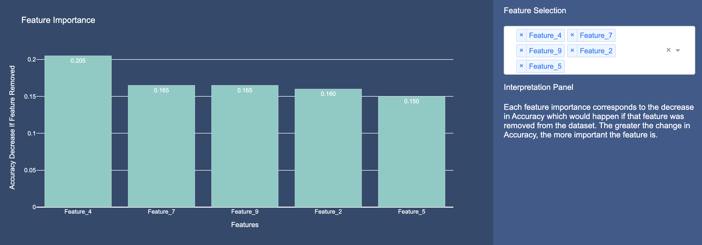
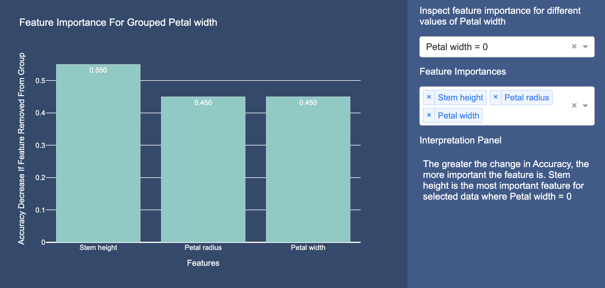

# Decima2 Feature Importance Tutorials 

## Model Feature Importance

  

### Introduction
In this repo we include have four example notebooks for you to explore the usage of Model Feature Importance 

### See how quickly Decima2 generates explanations 
In [this notebook](https://github.com/Decima2/Decima2Toolkit/blob/main/examples/model_insights/model_explanations/Model_Feature_Importance_Adult.ipynb) we compare the run times of [SHAP](https://github.com/shap/shap) and Decima2 model feature importances on the Adult dataset. We show that Decima2 is double as fast as SHAP on this dataset. 

In [this notebook](https://github.com/Decima2/Decima2Toolkit/blob/main/examples/model_insights/model_explanations/Model_Feature_Importance_California.ipynb) we compare the run times of [SHAP](https://github.com/shap/shap) and Decima2 model feature importances on the California dataset. We show that Decima2 is ten times as fast as SHAP on this dataset. 

### See how accurate Decima2 is when data is dependent

In [this notebook](https://github.com/Decima2/Decima2Toolkit/blob/main/examples/model_insights/model_explanations/Model_Feature_Importance_Synthetic.ipynb) we construct a synthetic dataset where features are dependent and show how Decima2, and not SHAP accurately identify the most important feature. 

In [this notebook](https://github.com/Decima2/Decima2Toolkit/blob/main/examples/model_insights/model_explanations/Model_Feature_Importance_Causal.ipynb) we adapt the causal dataset from the [SHAP documentation](https://shap.readthedocs.io/en/latest/example_notebooks/overviews/Be%20careful%20when%20interpreting%20predictive%20models%20in%20search%20of%20causal%20insights.html) and show how Decima2 explanations address the limitations of SHAP on this dataset. 

## Grouped Feature Importance

  

### See how Grouped Feature Importance can help you debug your model 
In this notebook (https://github.com/Decima2/Decima2Toolkit/blob/main/examples/model_insights/model_explanations/Grouped_Feature_Importance.ipynb) we show how you can use Grouped Feature Importance to identify vulnerabilities in your model. 